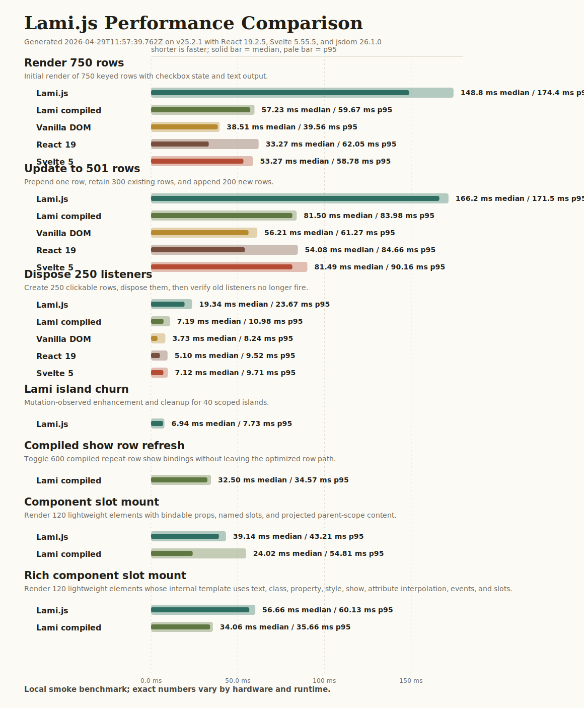

# Lami.js Performance Report

Generated at 2026-04-29T11:57:39.762Z on v25.2.1 (darwin arm64).

Runtime versions: jsdom 26.1.0, React 19.2.5, Svelte 5.55.5.

These numbers are local smoke benchmarks. They are intended to catch regressions
and provide a concrete performance story for Lami.js scenarios; they are not a
formal cross-framework benchmark.

## Comparison Scenarios

| Scenario | Engine | Runs | Median | Min | p95 | Median heap delta |
| --- | --- | ---: | ---: | ---: | ---: | ---: |
| Render 750 rows | Lami.js | 7 | 148.8 ms | 141.0 ms | 174.4 ms | 10866.9 KB |
| Render 750 rows | Lami compiled | 7 | 57.23 ms | 49.83 ms | 59.67 ms | 2709.3 KB |
| Render 750 rows | Vanilla DOM | 7 | 38.51 ms | 33.86 ms | 39.56 ms | -6083.6 KB |
| Render 750 rows | React 19 | 7 | 33.27 ms | 28.75 ms | 62.05 ms | 634.4 KB |
| Render 750 rows | Svelte 5 | 7 | 53.27 ms | 49.80 ms | 58.78 ms | -215.2 KB |
| Update to 501 rows | Lami.js | 7 | 166.2 ms | 164.4 ms | 171.5 ms | 19251.5 KB |
| Update to 501 rows | Lami compiled | 7 | 81.50 ms | 80.12 ms | 83.98 ms | 18360.9 KB |
| Update to 501 rows | Vanilla DOM | 7 | 56.21 ms | 54.89 ms | 61.27 ms | 14356.1 KB |
| Update to 501 rows | React 19 | 7 | 54.08 ms | 47.84 ms | 84.66 ms | 8107.2 KB |
| Update to 501 rows | Svelte 5 | 7 | 81.49 ms | 79.75 ms | 90.16 ms | 12105.9 KB |
| Dispose 250 listeners | Lami.js | 9 | 19.34 ms | 17.53 ms | 23.67 ms | 15440.4 KB |
| Dispose 250 listeners | Lami compiled | 9 | 7.19 ms | 6.86 ms | 10.98 ms | 6122.7 KB |
| Dispose 250 listeners | Vanilla DOM | 9 | 3.73 ms | 3.36 ms | 8.24 ms | 3627.9 KB |
| Dispose 250 listeners | React 19 | 9 | 5.10 ms | 4.68 ms | 9.52 ms | 4407.9 KB |
| Dispose 250 listeners | Svelte 5 | 9 | 7.12 ms | 6.44 ms | 9.71 ms | 5659.1 KB |

## Lami-Specific Scenario

| Scenario | Engine | Runs | Median | Min | p95 | Median heap delta |
| --- | --- | ---: | ---: | ---: | ---: | ---: |
| Lami island churn | Lami.js | 7 | 6.94 ms | 6.47 ms | 7.73 ms | 4351.9 KB |
| Compiled show row refresh | Lami compiled | 7 | 32.50 ms | 30.61 ms | 34.57 ms | 24218.7 KB |
| Component slot mount | Lami.js | 7 | 39.14 ms | 37.03 ms | 43.21 ms | -14554.0 KB |
| Component slot mount | Lami compiled | 7 | 24.02 ms | 21.36 ms | 54.81 ms | 21307.4 KB |
| Rich component slot mount | Lami.js | 7 | 56.66 ms | 54.86 ms | 60.13 ms | -3292.0 KB |
| Rich component slot mount | Lami compiled | 7 | 34.06 ms | 30.67 ms | 35.66 ms | -14242.4 KB |
