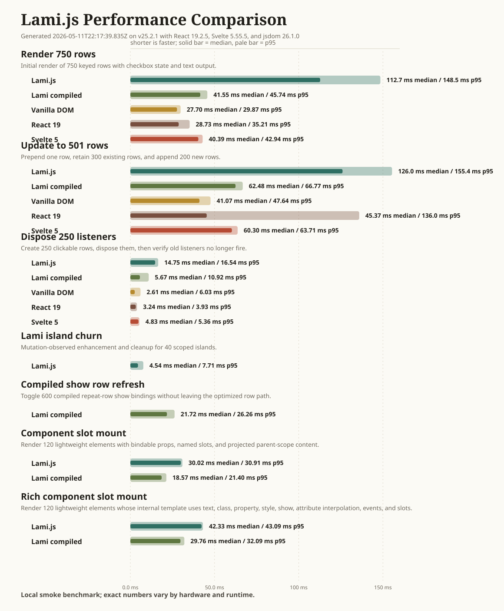

# Lami.js Performance Report

Generated at 2026-05-11T22:17:39.835Z on v25.2.1 (darwin arm64).

Runtime versions: jsdom 26.1.0, React 19.2.5, Svelte 5.55.5.

These numbers are local smoke benchmarks. They are intended to catch regressions
and provide a concrete performance story for Lami.js scenarios; they are not a
formal cross-framework benchmark.

## Comparison Scenarios

| Scenario | Engine | Runs | Median | Min | p95 | Median heap delta |
| --- | --- | ---: | ---: | ---: | ---: | ---: |
| Render 750 rows | Lami.js | 7 | 112.7 ms | 105.7 ms | 148.5 ms | 8414.3 KB |
| Render 750 rows | Lami compiled | 7 | 41.55 ms | 37.30 ms | 45.74 ms | 3373.9 KB |
| Render 750 rows | Vanilla DOM | 7 | 27.70 ms | 23.08 ms | 29.87 ms | -5081.1 KB |
| Render 750 rows | React 19 | 7 | 28.73 ms | 24.05 ms | 35.21 ms | 602.0 KB |
| Render 750 rows | Svelte 5 | 7 | 40.39 ms | 36.72 ms | 42.94 ms | 1901.8 KB |
| Update to 501 rows | Lami.js | 7 | 126.0 ms | 119.9 ms | 155.4 ms | 19649.1 KB |
| Update to 501 rows | Lami compiled | 7 | 62.48 ms | 58.83 ms | 66.77 ms | 18721.0 KB |
| Update to 501 rows | Vanilla DOM | 7 | 41.07 ms | 39.82 ms | 47.64 ms | 14454.8 KB |
| Update to 501 rows | React 19 | 7 | 45.37 ms | 37.71 ms | 136.0 ms | 8776.5 KB |
| Update to 501 rows | Svelte 5 | 7 | 60.30 ms | 58.52 ms | 63.71 ms | 12157.6 KB |
| Dispose 250 listeners | Lami.js | 9 | 14.75 ms | 13.28 ms | 16.54 ms | 15437.8 KB |
| Dispose 250 listeners | Lami compiled | 9 | 5.67 ms | 5.21 ms | 10.92 ms | 6123.0 KB |
| Dispose 250 listeners | Vanilla DOM | 9 | 2.61 ms | 2.30 ms | 6.03 ms | 3644.3 KB |
| Dispose 250 listeners | React 19 | 9 | 3.24 ms | 3.05 ms | 3.93 ms | 4408.3 KB |
| Dispose 250 listeners | Svelte 5 | 9 | 4.83 ms | 4.49 ms | 5.36 ms | 5662.9 KB |

## Lami-Specific Scenario

| Scenario | Engine | Runs | Median | Min | p95 | Median heap delta |
| --- | --- | ---: | ---: | ---: | ---: | ---: |
| Lami island churn | Lami.js | 7 | 4.54 ms | 4.15 ms | 7.71 ms | 4336.2 KB |
| Compiled show row refresh | Lami compiled | 7 | 21.72 ms | 20.74 ms | 26.26 ms | 24223.1 KB |
| Component slot mount | Lami.js | 7 | 30.02 ms | 26.63 ms | 30.91 ms | -16381.4 KB |
| Component slot mount | Lami compiled | 7 | 18.57 ms | 15.33 ms | 21.40 ms | 21290.8 KB |
| Rich component slot mount | Lami.js | 7 | 42.33 ms | 40.69 ms | 43.09 ms | -3166.2 KB |
| Rich component slot mount | Lami compiled | 7 | 29.76 ms | 25.92 ms | 32.09 ms | -14040.8 KB |
